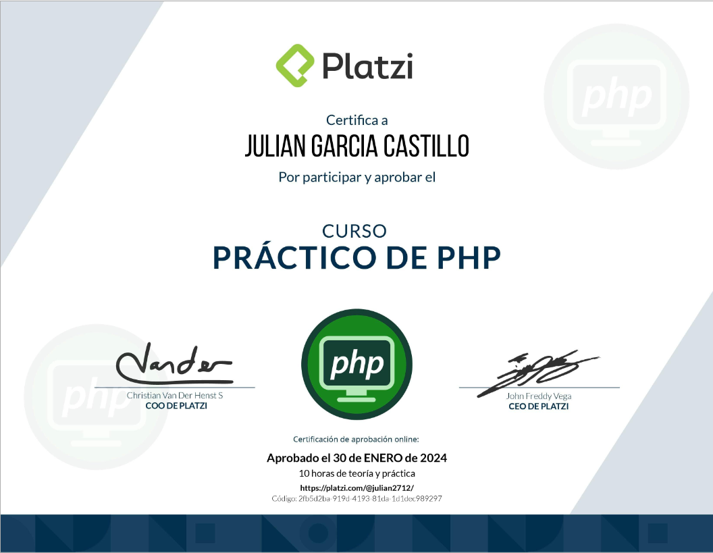

## Ruta PHP
### Curso 3

# Descripción
Rápido, flexible y pragmático, PHP impulsa todo, desde un blog hasta los sitios web más populares del mundo. En este curso, practica los fundamentos de la programación en PHP, desde los conceptos básicos hasta un microproyecto y retos que reforzaran tus conocimientos.
